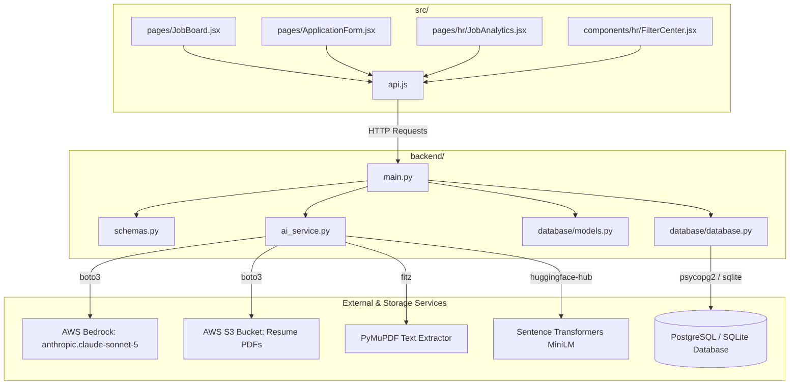

# 📁 Project-Specific File Architecture — HR Portal (RIS)

This architecture reference maps strictly to the **actual files present in this repository**.

---

## 🗺️ Workspace File Tree & Layer Breakdown

```
HR_Portal_RIS/
├── 📄 1.ipynb                           # Jupyter Notebook for testing AWS Bedrock Claude API
├── 📄 ARCHITECTURE.md                  # Project file architecture & system design (this file)
├── 📄 index.html                       # Single Page Application entry HTML template
├── 📄 package.json                     # Frontend Node package manifest & build scripts
├── 📄 vite.config.js                   # Vite bundler configuration
├── 📄 nginx.conf                       # Production Nginx reverse proxy configuration
├── 📄 docker-compose.yml               # Multi-container deployment configuration
├── 📄 vercel.json                      # Vercel deployment configuration
├── 📄 patch_app_form.py                # Maintenance script: Patches frontend application form
├── 📄 patch_filter.py                  # Maintenance script: Patches candidate filtering logic
├── 📄 diagnose_white_screen.py         # Frontend troubleshooting script
├── 📄 diag_db.py                       # Database connection diagnostic utility
├── 📄 start_persistent_servers.py      # Development environment launcher for backend & frontend
├── 📄 test_ai_api.py                   # CLI test script for AI embeddings subsystem
├── 📁 src/                             # React Frontend Source Code
│   ├── 📄 main.jsx                     # React root renderer
│   ├── 📄 App.jsx                      # App router & global route definitions
│   ├── 📄 api.js                       # Axios/Fetch API client for calling FastAPI endpoints
│   ├── 📄 index.css                    # Design system tokens & global styling
│   ├── 📄 App.css                      # Application layout styles
│   ├── 📁 pages/                       # User & HR View Pages
│   │   ├── 📄 ApplicationForm.jsx      # Multi-step Candidate Registration & Resume Upload Form
│   │   ├── 📄 JobBoard.jsx             # Public Job Openings & Listings Page
│   │   └── 📁 hr/                      # HR Portal Dashboard Pages
│   │       ├── 📄 HRLayout.jsx         # HR Navigation header & sidebar shell
│   │       ├── 📄 HRLogin.jsx          # HR Administrator Authentication Page
│   │       ├── 📄 JobPostings.jsx      # Job Creation & Management Dashboard
│   │       ├── 📄 JobAnalytics.jsx     # Candidate applications dashboard per job posting
│   │       └── 📄 GlobalAnalytics.jsx  # Platform-wide candidate metrics & statistics
│   └── 📁 components/hr/               # HR Dashboard Modal Components
│       ├── 📄 CandidateProfileModal.jsx # Full candidate resume, score & details view modal
│       ├── 📄 FilterCenter.jsx          # Advanced candidate filtering & AI semantic search panel
│       ├── 📄 CreateJobModal.jsx        # Job Creation Modal form
│       ├── 📄 JobViewModal.jsx          # Job Posting Details viewer modal
│       └── 📄 DraftPreviewModal.jsx     # Job Draft Preview modal
└── 📁 backend/                         # Python FastAPI Backend
    ├── 📄 main.py                      # Primary FastAPI REST server (Auth, Jobs, Applications, AI routes)
    ├── 📄 ai_service.py                # AI Subsystem (PyMuPDF PDF parsing, HF vectorization, S3 uploads, Bedrock)
    ├── 📄 schemas.py                   # Pydantic request/response validation schemas
    ├── 📄 requirements.txt             # Python dependencies (FastAPI, boto3, PyMuPDF, SQLAlchemy, etc.)
    ├── 📄 diag_ai.py                   # AI vectorization diagnostic script
    ├── 📄 run_migration.py             # Database schema migration executor
    ├── 📄 smart_migration.py           # Auto-detect schema migration helper
    ├── 📄 clean_and_populate.py        # Database reset & sample data seeder
    └── 📁 database/                    # Relational Data Tier
        ├── 📄 database.py              # Database engine setup, SessionLocal factory, SSL config
        └── 📄 models.py                # SQLAlchemy ORM Data Models (11 tables)
```

---

## 🔗 How Specific Files Interact



---

## 📄 File-by-File Responsibilities

### 1. Backend Core (`backend/`)

| File Path | Direct Responsibility |
| :--- | :--- |
| [`backend/main.py`](file:///Users/pranshu/Desktop/RIS_Dashboard/HR_Career/HR_Portal_RIS/backend/main.py) | **Primary REST API Server**. Handles routes for authentication (`/token`), job CRUD (`/api/jobs`), candidate applications (`/api/applications`), resume uploads, semantic AI candidate search (`/api/jobs/{id}/candidates/search`), and Excel export data generation. |
| [`backend/ai_service.py`](file:///Users/pranshu/Desktop/RIS_Dashboard/HR_Career/HR_Portal_RIS/backend/ai_service.py) | **AI & Media Utility Layer**. Extracts text from PDF files using `fitz`, generates vector embeddings via Hugging Face (`compute_embedding`), uploads PDFs to AWS S3, calculates cosine similarity for searches, and houses AWS Bedrock Claude helper routines. |
| [`backend/database/database.py`](file:///Users/pranshu/Desktop/RIS_Dashboard/HR_Career/HR_Portal_RIS/backend/database/database.py) | **Database Connection Engine**. Initializes SQLAlchemy engine using `DATABASE_URL`, configures SSL for cloud databases, creates `SessionLocal` sessions, and auto-closes expired job deadlines on startup. |
| [`backend/database/models.py`](file:///Users/pranshu/Desktop/RIS_Dashboard/HR_Career/HR_Portal_RIS/backend/database/models.py) | **ORM Entity Definitions**. Contains 11 SQLAlchemy models: `JobPosting`, `CandidateMetadata`, `ApplicationTracking`, `ApplicationStatusHistory`, `CandidateSchooling`, `CandidateHigherEducation`, `CandidateWorkExperience`, `CandidatePublication`, `CandidateLinksAbout`, `CandidateResumePayload`, and `TokenRegistry`. |
| [`backend/schemas.py`](file:///Users/pranshu/Desktop/RIS_Dashboard/HR_Career/HR_Portal_RIS/backend/schemas.py) | **Data Validation Schemas**. Pydantic schemas validating API payloads for candidate registration, job postings, status updates, and search parameters. |

---

### 2. Frontend Core (`src/`)

| File Path | Direct Responsibility |
| :--- | :--- |
| [`src/api.js`](file:///Users/pranshu/Desktop/RIS_Dashboard/HR_Career/HR_Portal_RIS/src/api.js) | Centralized HTTP client module for sending REST API requests to `backend/main.py`. |
| [`src/pages/ApplicationForm.jsx`](file:///Users/pranshu/Desktop/RIS_Dashboard/HR_Career/HR_Portal_RIS/src/pages/ApplicationForm.jsx) | Multi-step candidate registration form where job seekers fill in personal, educational, work experience details and upload resume PDFs. |
| [`src/pages/JobBoard.jsx`](file:///Users/pranshu/Desktop/RIS_Dashboard/HR_Career/HR_Portal_RIS/src/pages/JobBoard.jsx) | Public job openings page listing active jobs and allowing candidates to apply. |
| [`src/pages/hr/JobAnalytics.jsx`](file:///Users/pranshu/Desktop/RIS_Dashboard/HR_Career/HR_Portal_RIS/src/pages/hr/JobAnalytics.jsx) | HR Dashboard for reviewing candidate applications, profile scores, application status updates, and exporting analytics reports. |
| [`src/components/hr/FilterCenter.jsx`](file:///Users/pranshu/Desktop/RIS_Dashboard/HR_Career/HR_Portal_RIS/src/components/hr/FilterCenter.jsx) | Interactive filtering side-drawer in HR dashboard allowing keyword search, score thresholds, experience filters, and vector AI search. |
| [`src/components/hr/CandidateProfileModal.jsx`](file:///Users/pranshu/Desktop/RIS_Dashboard/HR_Career/HR_Portal_RIS/src/components/hr/CandidateProfileModal.jsx) | Detailed modal view showing a candidate's complete profile, resume PDF, education breakdown, publications, and AI match metrics. |

---

### 3. Testing & Maintenance Files

| File Path | Direct Responsibility |
| :--- | :--- |
| [`1.ipynb`](file:///Users/pranshu/Desktop/RIS_Dashboard/HR_Career/HR_Portal_RIS/1.ipynb) | Jupyter notebook used for testing AWS Bedrock Claude API integration (`anthropic.claude-sonnet-5`) and credentials. |
| [`test_ai_api.py`](file:///Users/pranshu/Desktop/RIS_Dashboard/HR_Career/HR_Portal_RIS/test_ai_api.py) | CLI testing script for validating vector embedding generation via `backend/ai_service.py`. |
| [`backend/diag_ai.py`](file:///Users/pranshu/Desktop/RIS_Dashboard/HR_Career/HR_Portal_RIS/backend/diag_ai.py) | Diagnostics script for inspecting database vector counts and query vectorization scores. |
| [`start_persistent_servers.py`](file:///Users/pranshu/Desktop/RIS_Dashboard/HR_Career/HR_Portal_RIS/start_persistent_servers.py) | Launcher script for spinning up FastAPI (`uvicorn main:app`) and Vite dev server (`npm run dev`). |
