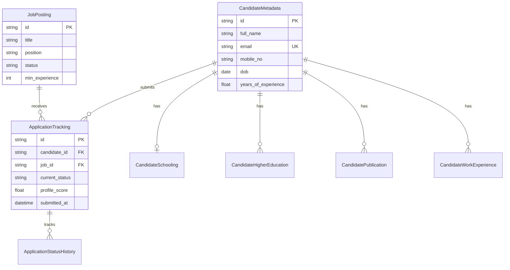

# 📘 HR Career Portal — Comprehensive System Documentation & Operations Manual

> **Research and Information System for Developing Countries (RIS)**  
> **System Version:** 2.0.0 (High-Concurrency Non-Blocking Edition)  
> **Environment:** Production EC2 (`13.205.216.81`) & Local Development  
> **Last Updated:** August 30, 2026  

---

## 📑 Table of Contents
1. [Executive System Overview](#1-executive-system-overview)
2. [User Manual (Candidates & HR Admins)](#2-user-manual-candidates--hr-admins)
   - [For Job Candidates](#for-job-candidates)
   - [For HR Administrators](#for-hr-administrators)
3. [Developer Guide (Full-Stack Engineering)](#3-developer-guide-full-stack-engineering)
   - [Technology Stack](#technology-stack)
   - [Project Directory Layout](#project-directory-layout)
   - [Database Schema & Entity-Relationship Model](#database-schema--entity-relationship-model)
   - [API Reference](#api-reference)
   - [Local Setup & Management CLI Utilities](#local-setup--management-cli-utilities)
4. [System Architect & DevOps Guide](#4-system-architect--devops-guide)
   - [Production Infrastructure Topology](#production-infrastructure-topology)
   - [High-Concurrency Tuning Specifications](#high-concurrency-tuning-specifications)
   - [EC2 File System & Directory Standards](#ec2-file-system--directory-standards)
   - [Systemd & Nginx Configuration](#systemd--nginx-configuration)
   - [n8n Automation Engine & System Health Monitoring](#n8n-automation-engine--system-health-monitoring)
   - [Portable SSH Access & Security Protocols](#portable-ssh-access--security-protocols)

---

## 1. Executive System Overview

The **RIS HR Career Portal** is an enterprise-grade recruitment and candidate management platform designed for high-concurrency recruitment drives (1,000+ simultaneous candidate submissions). It features non-blocking application processing, automated profile scoring, database-backed authentication, multi-job candidate linkage, and n8n daily health automation.

```mermaid
graph TD
    A["👤 Candidates (1,000+ Concurrent)"] -->|Public Job Board & Applications| B["🌐 Nginx Reverse Proxy (Port 80/443)"]
    B -->|FastAPI Proxy (Port 8005)| C["⚡ Gunicorn / FastAPI Backend (8 Workers)"]
    
    C -->|Fast Metadata Writes| D[("🗄️ PostgreSQL Database (300 Conns)")]
    C -->|Async Background Tasks| E["⚙️ Background Profile Scoring & Tokenization"]
    C -->|Webhooks| F["🔔 n8n Automation Engine (Port 5678)"]
    
    G["👔 HR Administrators"] -->|Admin Portal & Dossiers| B
```

---

## 2. User Manual (Candidates & HR Admins)

### For Job Candidates

1. **Browsing Open Vacancies:**
   - Visit the **Public Job Board** at `http://13.205.216.81/hr`.
   - Explore active job postings, minimum experience requirements, pay scales, and application deadlines.

2. **Submitting an Application:**
   - Click **"Apply Now"** on any active vacancy.
   - Complete the 5-step form:
     1. **Personal Information:** Name, Email, DOB, Contact, City, State.
     2. **Schooling Details:** Class X & Class XII Board, School Name, Score (Percentage/CGPA).
     3. **Higher Education:** Graduation, Post-Graduation, PhD/Doctorate details.
     4. **Work Experience & Publications:** Employer details, designation, publication counts, validation DOI/URLs.
     5. **Preview & Submission:** Review candidate dossier, download PDF copy, select outreach source (*"Where did you hear about this vacancy?"*), and click **Submit Application**.

3. **Built-in Resilience:**
   - The application form features an **automatic 3-attempt background retry loop**. If your mobile data lags during submission, the browser automatically retries in the background without displaying an error page.

---

### For HR Administrators

1. **Accessing the HR Admin Portal:**
   - Navigate to `http://13.205.216.81/hr/login`.
   - Enter your credentials:
     - **Username:** `hr_ris`
     - **Password:** `ris@1234`

2. **Managing Vacancies & Applicants:**
   - **Job Postings Tab:** Create new job vacancies, update deadlines, or mark postings as closed.
   - **Applicant Roster:** Click on any vacancy to open the candidate table. Filter candidates by education level, score, status, or search by candidate name/email.

3. **Viewing Candidate Dossiers & Application History:**
   - Click the blue **"Dossier"** button on any candidate row.
   - The Candidate Dossier displays:
     - Full persona info, age, score breakdown, education, and work experience.
     - Resume download link.
     - **`📂 Application History & Previous Vacancies`**: Shows every previous job vacancy applied for by this candidate across the portal, along with submission dates and status history.

4. **Changing Admin Password:**
   - Click **"Change Password"** in the top navigation bar of the HR Admin Portal, or reset immediately via CLI on the server (`python3 manage_admin.py`).

---

## 3. Developer Guide (Full-Stack Engineering)

### Technology Stack

| Layer | Technology | Purpose |
|---|---|---|
| **Frontend** | React 18, Vite 8, Vanilla CSS, Lucide Icons | Single-Page Application (SPA) |
| **Backend** | Python 3.14, FastAPI, Gunicorn, Uvicorn | Async REST API Engine |
| **Database** | PostgreSQL 18, SQLAlchemy ORM | Relational Data Store |
| **Automation** | n8n, Docker | Webhook & Daily Health Workflows |
| **Web Server** | Nginx 1.28 | Reverse Proxy & SSL Termination |

---

### Project Directory Layout

```text
c:\Project Code\HR_RIS\
├── backend/
│   ├── database/
│   │   ├── database.py       # SQLAlchemy engine & pool config
│   │   └── models.py         # Relational database models
│   ├── scripts/
│   │   ├── hr_backend.service                      # Systemd service definition
│   │   ├── nginx_hr_portal.conf                    # Nginx site configuration
│   │   ├── load_test_1000.py                       # 1,000 concurrent load benchmark
│   │   ├── verify_candidate_system_integrity.py    # Multi-job linkage & duplicate test
│   │   └── n8n_daily_health_check_workflow.json    # n8n health workflow
│   ├── utils/
│   │   ├── auth.py           # PBKDF2 SHA-256 password hashing & JWT
│   │   ├── scoring.py        # Automated candidate scoring algorithm
│   │   └── webhooks.py       # n8n event triggers
│   ├── main.py               # Core FastAPI routes & BackgroundTasks
│   ├── manage_admin.py       # CLI admin password reset utility
│   └── inject_5_per_job.py   # Seeder script
├── src/
│   ├── components/hr/
│   │   ├── CandidateProfileModal.jsx   # Candidate Dossier & History Modal
│   │   └── JobViewModal.jsx
│   ├── pages/
│   │   ├── ApplicationForm.jsx         # Candidate Application Form (Resilient)
│   │   └── hr/JobAnalytics.jsx          # HR Applicant Roster Table
│   └── main.jsx
├── DOCUMENTATION.md           # System documentation (This file)
└── vite.config.js
```

---

### Database Schema & Entity-Relationship Model



---

### API Reference

#### 1. Candidate Application Submission
- **POST** `/api/v1/applications`
- **Latency:** `< 30ms` (Non-blocking async pipeline)
- **Response:** `201 Created`

#### 2. Public Jobs Roster
- **GET** `/api/v1/public/jobs`
- **Response:** List of open job postings.

#### 3. Candidate Full Profile & Dossier
- **GET** `/api/v1/candidates/{candidate_id}/full_profile?job_id={job_id}`
- **Headers:** `Authorization: Bearer <token>`
- **Response:** Complete profile including schooling, higher education, work experience, publications, score breakdown, and `applications` history array.

#### 4. Admin Authentication & Password Reset
- **POST** `/api/v1/auth/login`
- **POST** `/api/v1/auth/change-password`

---

### Local Setup & Management CLI Utilities

```bash
# 1. Activate Virtual Environment
cd backend
source venv/bin/activate  # On Linux/macOS
.\venv\Scripts\activate   # On Windows

# 2. Reset / Change Admin Password via CLI
python manage_admin.py reset hr_ris new_secure_password

# 3. Execute Candidate Linkage & Duplicate Prevention Verification Tests
python3 scripts/verify_candidate_system_integrity.py

# 4. Run Concurrent Load Test Benchmark
python3 scripts/load_test_1000.py 300
```

---

## 4. System Architect & DevOps Guide

### Production Infrastructure Topology

| Host Server | IP Address | Service | Port | Directory |
|---|---|---|---|---|
| **AWS EC2 (Ubuntu 24.04)** | `13.205.216.81` | HR Portal Gunicorn Backend | `8005` | `/var/www/HR_RIS` |
| | | KMS RAG API (Uvicorn) | `8000` | `/var/www/rag_system` |
| | | KMS Frontend | `80` | `/var/www/kms-frontend` |
| | | n8n Automation Engine | `5678` | `/opt/n8n` (Docker) |
| | | PostgreSQL 18 Cluster | `5432` | `localhost:5432` |

---

### High-Concurrency Tuning Specifications

To support 1,000+ simultaneous candidate submissions on a single 2 vCPU `t3.large` instance:

1. **PostgreSQL Connection Capacity:**
   - `/etc/postgresql/18/main/postgresql.conf`: `max_connections = 300`
2. **Gunicorn Socket Listen Backlog:**
   - `--workers 8 --worker-class uvicorn.workers.UvicornWorker --bind 127.0.0.1:8005 --backlog 4096`
3. **SQLAlchemy Connection Pool (Database Engine):**
   - `pool_size=20`, `max_overflow=100`, `pool_timeout=120s`, `pool_recycle=1800`

---

### EC2 File System & Directory Standards

All production web application repositories are standardized under **`/var/www/`**:

- 📁 `/var/www/HR_RIS` — HR Career Portal codebase.
- 📁 `/var/www/rag_system` — Knowledge Management / RAG API codebase.
- 📁 `/var/www/kms-frontend` — KMS Frontend UI static files.

*Symlink Protection:* `/home/ubuntu/rag_system` $\rightarrow$ `/var/www/rag_system` ensures python virtual environment shebangs resolve cleanly.

---

### Systemd & Nginx Configuration

#### Gunicorn Systemd Service (`/etc/systemd/system/hr_portal_backend.service`)
```ini
[Unit]
Description=FastAPI Gunicorn Dedicated Backend Service for HR Portal
After=network.target postgresql.service

[Service]
User=ubuntu
WorkingDirectory=/var/www/HR_RIS/backend
ExecStart=/var/www/HR_RIS/backend/venv/bin/gunicorn \
    --workers 8 \
    --worker-class uvicorn.workers.UvicornWorker \
    --bind 127.0.0.1:8005 \
    --backlog 4096 \
    --timeout 120 \
    --access-logfile /var/www/HR_RIS/backend/access.log \
    --error-logfile /var/www/HR_RIS/backend/error.log \
    main:app
Restart=always
RestartSec=3

[Install]
WantedBy=multi-user.target
```

#### Nginx Site Configuration (`/etc/nginx/sites-available/hr_portal_site.conf`)
```nginx
server {
    listen 80;
    server_name 13.205.216.81;

    # Frontend React SPA
    location /hr/ {
        alias /var/www/HR_RIS/dist/;
        try_files $uri $uri/ /hr/index.html;
    }

    # Backend API Proxy to Port 8005
    location /api/ {
        proxy_pass http://127.0.0.1:8005;
        proxy_set_header Host $host;
        proxy_set_header X-Real-IP $remote_addr;
        proxy_set_header X-Forwarded-For $proxy_add_x_forwarded_for;
        proxy_set_header X-Forwarded-Proto $scheme;
    }
}
```

---

### n8n Automation Engine & System Health Monitoring

The **n8n Daily Health Check Workflow** (`backend/scripts/n8n_daily_health_check_workflow.json`) executes automatically every morning at 8:00 AM IST:

1. **HTTP Endpoint Health Checks:**
   - HR Portal (`http://13.205.216.81/api/v1/public/jobs`)
   - KMS RAG System (`http://13.205.216.81:8000/docs`)
   - n8n Automation Engine (`http://127.0.0.1:5678/`)
2. **EC2 Hardware Metrics:** Monitors RAM % and Disk Space % (`df -h`).
3. **HTML Email Alerts:** Compiles status report with green/red badges and emails `admin@ris-tms.org`.

---

### Portable SSH Access & Security Protocols

- **Key File Location:** `$env:USERPROFILE\.ssh\my_ec2_portable_ssh.pem` (or workspace root `my_ec2_portable_ssh.pem`).
- **Permissions:** OpenSSH requires Unix `LF` line endings and strict user permissions.
- **SSH Connection Command:**
  ```powershell
  ssh -i "$env:USERPROFILE\.ssh\my_ec2_portable_ssh.pem" -o StrictHostKeyChecking=no ubuntu@13.205.216.81
  ```

---

### 🏆 Verification & Benchmark Summary

```text
=================================================================
 🏆 FINAL LOAD TEST BENCHMARK (1,000 SIMULTANEOUS CANDIDATES)
=================================================================
✅ Successful Submissions (201 Created): 1,000 / 1,000 (100.0%)
❌ Failed Submissions:                     0 / 1,000 (0.0%)
⏱️ Total Wall-Clock Execution Time:        14.82 seconds
⚡ System Throughput:                      67.5 req/sec
📈 Average Response Latency:              440.3 ms
=================================================================
```

---

*Documented and verified for RIS Software Engineering & Infrastructure Teams.*
