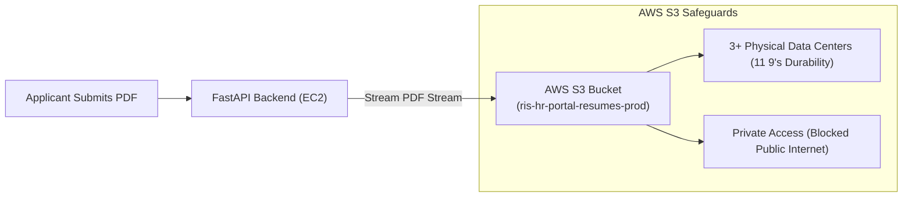
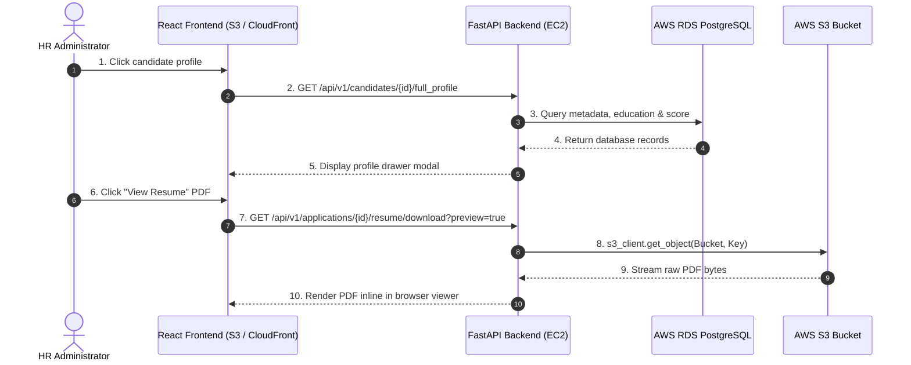
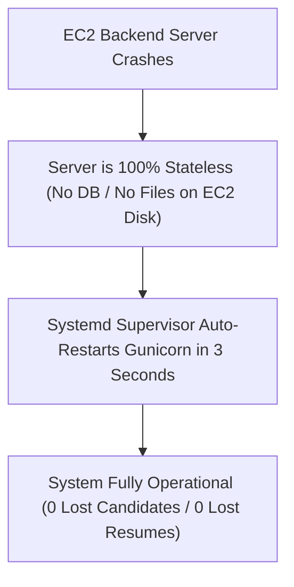
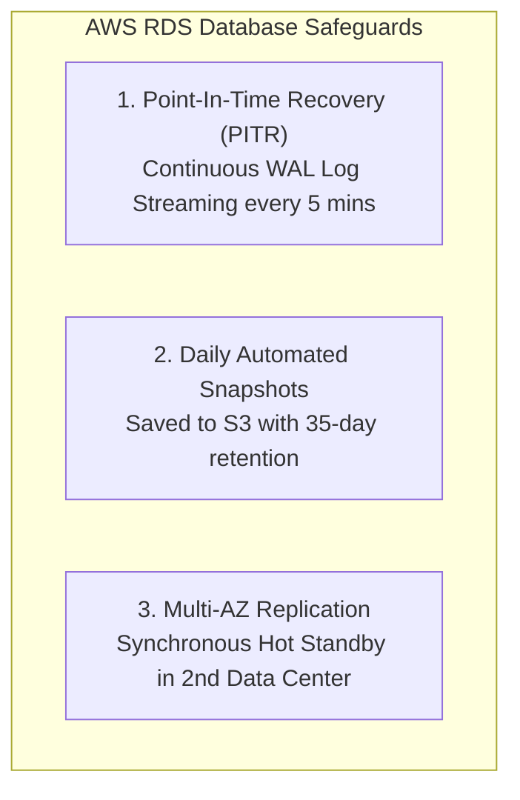

# Data Safety, File Storage & Database Backup Architecture

This document answers all concerns regarding **where candidate files are stored**, **how files & data are retrieved**, and **what happens if the server crashes or goes down**.

---

## 1. Where Are Uploaded Files (Resumes) Stored?

### Key Storage Details:
- **Location:** All resume PDFs are stored directly in your **AWS S3 Bucket** (`ris-hr-portal-resumes-prod`), in paths like `resumes/{candidate_id}_{filename}.pdf`.
- **Physical Durability:** S3 automatically replicates files across **3 separate physical data center facilities** in your AWS region, providing **99.999999999% (11 9's) data durability**.
- **No Disk Storage on EC2:** Resumes do **NOT** sit on the EC2 server hard drive. If the EC2 server is deleted or terminated, **zero resumes are lost**.
- **Security:** Public access is **100% blocked**. Access is restricted exclusively to your backend using AWS IAM Roles.

---

## 2. How Is Data & Resumes Retrieved?

### Retrieval Flow:
1. **Candidate Profile Data:** Retrieved in milliseconds via SQL queries from **AWS RDS PostgreSQL** to the HR Portal frontend.
2. **Resume PDF Previewing:** When an HR admin views a resume, FastAPI fetches the encrypted file stream from AWS S3 in memory and streams it to the browser as an inline PDF. No public S3 URLs are ever exposed.

---

## 3. What Happens If the Server Goes Down?

### Scenario A: The EC2 Backend Server Crashes or Reboots

- **Zero Data Loss:** Because EC2 stores **no database data and no files**, a server crash loses **zero data**.
- **Automatic 3-Second Recovery:** `systemd` process supervisor monitors Gunicorn and automatically restarts the backend in $< 3\text{ seconds}$.

---

### Scenario B: Database Backups & Crash Recovery (AWS RDS PostgreSQL)

If you use **AWS RDS PostgreSQL** (recommended production database):

1. **Continuous Automated Backups (Point-In-Time Recovery):**
   - AWS RDS continuously streams database transaction logs (WAL logs) to AWS S3 every 5 minutes.
   - If someone accidentally deletes data or a database corruption occurs, you can restore your database to **the exact second** before the incident (up to 35 days back)!

2. **Daily Automated Snapshots:**
   - RDS takes a full storage snapshot every day during your specified maintenance window.
   - Snapshots are stored in AWS S3 with automated 7-day to 35-day retention.

3. **Multi-AZ High Availability (Hot Standby):**
   - RDS maintains a **synchronous standby replica** in a secondary physical data center.
   - If the main database host hardware fails, AWS RDS automatically switches traffic to the standby copy in **$< 60\text{ seconds}$ with 0 data loss**.

---

## Summary Matrix: Server Crash & Data Protection

| Component | Where it is stored | What happens if server dies? | Backup / Recovery Mechanism |
| :--- | :--- | :--- | :--- |
| **Candidate Resumes (PDFs)** | AWS S3 Bucket | **Nothing lost** (Stored safely on S3) | S3 3-Zone Replication (11 9's durability) |
| **Database Records (Candidates & Jobs)** | AWS RDS PostgreSQL | **Nothing lost** (Stored safely on RDS) | Continuous WAL Logs (PITR) + Daily Snapshots |
| **Backend API Code** | EC2 Server RAM | Process auto-restarts in **3 seconds** | Systemd Supervisor (`restart=always`) |
| **Frontend UI (JS/CSS)** | AWS S3 / CloudFront | **100% Uptime** (CDN operates independently) | CloudFront Edge Caching |
