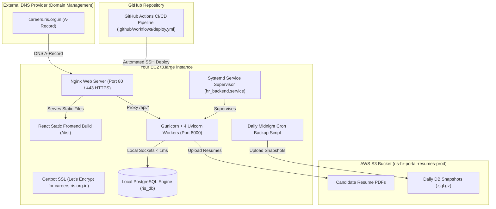

# Deployment Implementation Plan — AWS EC2 (`t3.large`) + CI/CD

This document details the production deployment execution plan for the **RIS HR & Career Portal** on your **`t3.large` EC2 instance (8 GB RAM)** with **External Domain `careers.ris.org.in`**, **Automated GitHub Actions CI/CD Pipeline**, **Self-Hosted PostgreSQL**, and **AWS S3** for resume PDFs/backups.

---

## User Review Required

> [!IMPORTANT]
> **Production Target Setup:**
> - **Domain Name:** `careers.ris.org.in` (External Domain — DNS A-Record will point to EC2 Public IP).
> - **CI/CD Automation:** GitHub Actions Pipeline (`.github/workflows/deploy.yml`). Automatically builds, tests, and deploys code on every push to `main`/`master`.
> - **Vercel Cleanup:** Vercel serverless configurations (`api/` and `vercel.json`) have been removed from the repository.
> - **Server Architecture:** AWS EC2 `t3.large` (2 vCPUs, 8 GB RAM) + PostgreSQL 15+ + AWS S3 Bucket (`ris-hr-portal-resumes-prod`).

---

## Target Deployment Architecture & Domain Flow



---

## Today's Deployment & Verification Timeline

### 1. External Domain Mapping (`careers.ris.org.in`)
- **DNS Action Required:** Log into your domain DNS registrar/DNS panel for `ris.org.in` and add an **A Record**:
  - **Host / Name:** `careers` (or `careers.ris.org.in`)
  - **Points to / Value:** `<YOUR-EC2-PUBLIC-IP>` (e.g. `13.127.xxx.xxx`)
  - **TTL:** 300 seconds

### 2. GitHub Actions Secrets Setup
In your GitHub repository settings (**Settings $\rightarrow$ Secrets and variables $\rightarrow$ Actions**), add:
- `EC2_HOST`: `<YOUR-EC2-PUBLIC-IP>`
- `EC2_USERNAME`: `ubuntu`
- `EC2_SSH_KEY`: Content of your SSH private key (`.pem` file)

### 3. Server Setup Command Checklist
On EC2 instance:
```bash
# 1. Install System Dependencies
sudo apt update && sudo apt install -y postgresql postgresql-contrib python3-pip python3-venv nginx git certbot python3-certbot-nginx awscli

# 2. Setup PostgreSQL
sudo -u postgres psql -c "CREATE DATABASE ris_db;"
sudo -u postgres psql -c "CREATE USER hr_user WITH PASSWORD 'YourSecurePassword123!';"
sudo -u postgres psql -c "GRANT ALL PRIVILEGES ON DATABASE ris_db TO hr_user;"
sudo -u postgres psql -d ris_db -c "GRANT ALL ON SCHEMA public TO hr_user;"

# 3. Clone Repository & Setup Virtual Environment
cd /var/www
sudo git clone https://github.com/your-org/HR_RIS.git
sudo chown -R ubuntu:ubuntu /var/www/HR_RIS
cd /var/www/HR_RIS/backend
python3 -m venv venv
source venv/bin/activate
pip install -r requirements.txt gunicorn uvicorn psycopg2-binary boto3 openpyxl

# 4. Copy Services & Configure Nginx
sudo cp /var/www/HR_RIS/backend/scripts/hr_backend.service /etc/systemd/system/
sudo systemctl daemon-reload
sudo systemctl enable --now hr_backend

sudo cp /var/www/HR_RIS/backend/scripts/nginx_hr_portal.conf /etc/nginx/sites-available/hr_portal
sudo ln -s /etc/nginx/sites-available/hr_portal /etc/nginx/sites-enabled/
sudo rm -f /etc/nginx/sites-enabled/default
sudo nginx -t && sudo systemctl restart nginx

# 5. Enable SSL for Domain
sudo certbot --nginx -d careers.ris.org.in

# 6. Setup Daily S3 Backup Cron
sudo cp /var/www/HR_RIS/backend/scripts/backup_db_to_s3.sh /usr/local/bin/
sudo chmod +x /usr/local/bin/backup_db_to_s3.sh
(crontab -l 2>/dev/null; echo "0 0 * * * /usr/local/bin/backup_db_to_s3.sh > /dev/null 2>&1") | crontab -
```

---

## Verification & Testing Plan

1. **CI/CD Pipeline Test:** Push code commit to GitHub `main` branch $\rightarrow$ verify GitHub Actions pipeline completes with green status.
2. **Domain SSL Test:** Open `https://careers.ris.org.in` in browser $\rightarrow$ verify valid SSL padlock icon and page load.
3. **Application Submission Test:** Complete public application form $\rightarrow$ verify submit success and check resume PDF in S3 bucket.
4. **HR Admin Roster & Export Test:** Log in to `/hr/login` $\rightarrow$ inspect full candidate profile and download 67-column Detailed Excel export (`.xlsx`).
