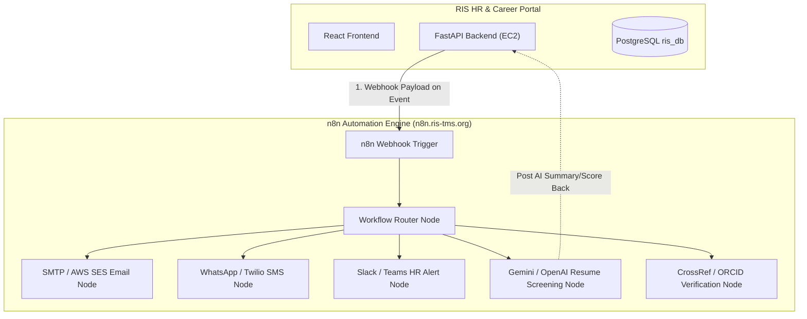

# n8n Workflow Automation Guide — RIS HR Portal

Integrating **n8n** (hosted at `https://n8n.ris-tms.org`) with your **RIS HR & Career Portal** allows you to automate candidate communication, HR alerts, interview scheduling, AI-assisted candidate screening, and publication verification without complicating your backend codebase.

---

## 1. System Integration Architecture



---

## 2. Top 6 High-Value Automation Workflows

### 1. Automated Branded Email Application Receipts
- **Trigger:** Candidate submits application (`POST /api/v1/applications`).
- **n8n Node Flow:** `Webhook` $\rightarrow$ `Format HTML Email` $\rightarrow$ `AWS SES / SMTP Email Node`.
- **Outcome:** Candidate instantly receives an official RIS branded confirmation email containing application ID, job title, and receipt timestamp.

### 2. Instant HR Team Alerts for High-Priority Positions
- **Trigger:** Candidate applies for a senior or consultant position.
- **n8n Node Flow:** `Webhook` $\rightarrow$ `Filter (Position == 'Consultant' or 'Director')` $\rightarrow$ `Slack / MS Teams / Email Node`.
- **Outcome:** Instantly notifies the Department Head or Senior HR Panel via Slack/Email with candidate background summary and a direct link to the HR portal candidate profile drawer.

### 3. Automated Shortlisting & Interview Calendar Invites
- **Trigger:** HR Admin changes candidate status to `shortlisted` or `interview_scheduled`.
- **n8n Node Flow:** `Webhook` $\rightarrow$ `Generate Google Calendar / iCal Event (.ics)` $\rightarrow$ `Send Email to Candidate`.
- **Outcome:** Candidate receives formal interview letter with calendar invite attachment.

### 4. AI-Powered Resume & Document Screening
- **Trigger:** Resume PDF uploaded to AWS S3.
- **n8n Node Flow:** `S3 Event / Webhook` $\rightarrow$ `Extract PDF Text` $\rightarrow$ `Gemini / OpenAI LLM Node` $\rightarrow$ `HTTP Request Node (Post Score to FastAPI)`.
- **Outcome:** Automatically extracts candidate key skills, verifies experience years against job requirements, generates a 3-bullet summary, and attaches an AI score to the candidate record.

### 5. Automated Publication & DOI Verification
- **Trigger:** Candidate enters DOI links or ORCID identifiers in Step 4.
- **n8n Node Flow:** `Webhook` $\rightarrow$ `HTTP Request (CrossRef API / OpenAlex API)` $\rightarrow$ `Verify Journal Peer-Review & Citations` $\rightarrow$ `Update Database`.
- **Outcome:** Verifies publication validity automatically before HR manual review.

### 6. Daily System Health & Backup Digest
- **Trigger:** n8n Cron Trigger (Runs daily at 08:00 AM).
- **n8n Node Flow:** `Cron` $\rightarrow$ `Check S3 Backup File Existence` $\rightarrow$ `Check EC2 Disk & RAM Usage` $\rightarrow$ `Email Report to IT Admin`.
- **Outcome:** Keeps IT leadership updated on system uptime, DB backup health, and server memory utilization.

---

## 3. How to Connect FastAPI Backend to n8n

Adding webhook triggers to FastAPI requires only a lightweight background helper:

### Helper Function in Backend (`backend/utils/webhooks.py`)
```python
import os
import requests
from fastapi import BackgroundTasks

N8N_BASE_URL = os.getenv("N8N_WEBHOOK_URL", "https://n8n.ris-tms.org/webhook")

def send_n8n_event(event_type: str, data: dict):
    try:
        url = f"{N8N_BASE_URL}/{event_type}"
        requests.post(url, json={"event": event_type, "data": data}, timeout=3)
    except Exception as e:
        print(f"[n8n Webhook Error] {event_type}: {e}")

def trigger_n8n_async(background_tasks: BackgroundTasks, event_type: str, data: dict):
    background_tasks.add_task(send_n8n_event, event_type, data)
```

### Usage Example in `backend/main.py`:
```python
@app.post("/api/v1/applications")
def create_application(payload: CandidateCreate, background_tasks: BackgroundTasks, db: Session = Depends(get_db)):
    # Save candidate & application to database...
    
    # Trigger n8n webhook asynchronously (does not slow down applicant response!)
    trigger_n8n_async(background_tasks, "candidate-applied", {
        "candidate_id": candidate.id,
        "full_name": candidate.full_name,
        "email": candidate.email,
        "position_applied": payload.position_applied,
        "submitted_at": str(datetime.utcnow())
    })
```
