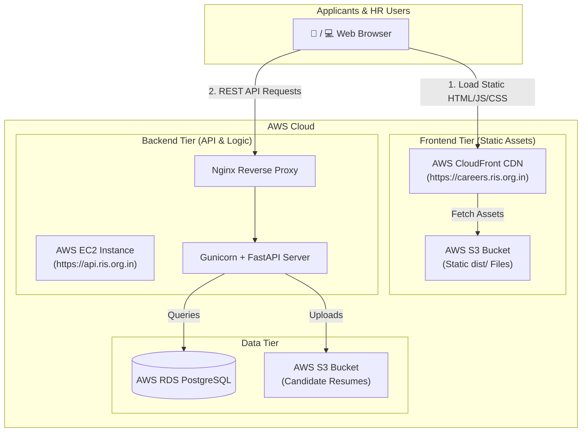

# AWS Architecture Guide: Frontend on S3 + Backend on EC2

Deploying the **React Frontend on AWS S3 (+ CloudFront)** and the **FastAPI Backend on AWS EC2** is a **best-practice production setup**. It separates static content delivery from application business logic, maximizing performance and reliability for 1,000+ concurrent applicants.

---

## System Architecture



---

## Key Benefits of this Split Architecture

1. **Zero EC2 CPU Load for Static Assets:**  
   Your EC2 server doesn't waste CPU or RAM serving JavaScript, CSS, or images. 100% of EC2 capacity is dedicated to processing candidate applications, filters, scoring, and Excel reporting.

2. **Ultra-Fast Global Asset Delivery:**  
   AWS CloudFront serves your frontend from 400+ edge locations worldwide with $< 50\text{ ms}$ latency and 99.999999999% (11 9's) availability.

3. **Independent Scalability & Zero-Downtime Updates:**  
   Updating the frontend UI requires syncing static files to S3 (`aws s3 sync dist/ s3://bucket`) — no backend server restarts or downtime required!

4. **Reduced AWS Costs:**  
   S3 static web hosting costs pennies per month ($0.50 - $2.00/mo), allowing you to use a smaller EC2 instance (e.g. `t4g.small` or `t4g.medium`).

---

## Required Configurations for S3 + EC2 Setup

### 1. CORS Configuration in Backend (`backend/.env` & `backend/main.py`)
Since Frontend is on `https://careers.ris.org.in` and Backend is on `https://api.ris.org.in`, the browser enforces CORS rules.

In `backend/.env`:
```env
ALLOWED_ORIGINS=https://careers.ris.org.in,https://your-cloudfront-id.cloudfront.net
```

In `backend/main.py` (already configured):
```python
app.add_middleware(
    CORSMiddleware,
    allow_origins=os.getenv("ALLOWED_ORIGINS", "*").split(","),
    allow_credentials=True,
    allow_methods=["*"],
    allow_headers=["*"],
)
```

### 2. Frontend API Base URL Configuration (`src/api.js`)
When building the frontend bundle for S3:

1. Create `.env.production` in project root:
   ```env
   VITE_API_URL=https://api.ris.org.in
   ```
2. Build command:
   ```bash
   npm run build
   ```
   *Vite compiles `API_BASE = 'https://api.ris.org.in/api/v1'` directly into `dist/static/` bundle.*

### 3. Frontend S3 Bucket & CloudFront Deployment Commands
```bash
# 1. Build Production React Bundle
npm run build

# 2. Sync to S3 Frontend Bucket
aws s3 sync dist/ s3://ris-hr-frontend-prod --delete

# 3. Invalidate CloudFront CDN Cache so users see new updates immediately
aws cloudfront create-invalidation --distribution-id YOUR_CF_DIST_ID --paths "/*"
```

### 4. Nginx Backend Configuration on EC2 (`/etc/nginx/sites-available/hr_backend`)
On your EC2 instance, Nginx handles API traffic and SSL:
```nginx
server {
    listen 80;
    server_name api.ris.org.in;

    # Backend API Proxy
    location /api/ {
        proxy_pass http://127.0.0.1:8000;
        proxy_http_version 1.1;
        proxy_set_header Host $host;
        proxy_set_header X-Real-IP $remote_addr;
        proxy_set_header X-Forwarded-For $proxy_add_x_forwarded_for;
        proxy_set_header X-Forwarded-Proto $scheme;
        client_max_body_size 15M;
    }
}
```

---

## Comparison: Single EC2 vs S3 Frontend + EC2 Backend

| Feature | Single EC2 Server | S3 Frontend + EC2 Backend (Recommended) |
| :--- | :--- | :--- |
| **Static Asset Load Speed** | Subject to EC2 region distance (~150-300ms) | Global CDN Edge Speed (<50ms) |
| **EC2 Server CPU Utilization** | Serves static files + API logic | 100% focused on API logic & database |
| **Deployment Simplicity** | Single server setup | 2-target deploy (S3 sync + EC2 update) |
| **Downtime during UI updates** | Brief server reload | **Zero downtime** (Instant S3 replacement) |
| **Cost Efficiency** | Requires larger EC2 instance | Uses minimal EC2 size + cheap S3 storage |
